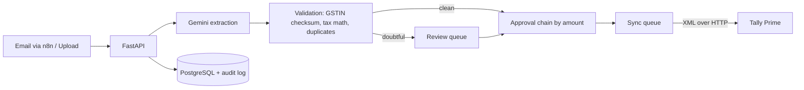

# BillFlow: AI Invoice-to-Tally Approval Automation

Vendor invoices come in by email or upload. AI extracts the data, the system checks GST and duplicates, the right approvers sign off, and the approved bill is posted to **Tally Prime** as a purchase voucher, with an audit trail on every step.

Built end to end as a solo project to solve a real accounts-payable problem: retyping bills into Tally, chasing approvals, and explaining mismatches at month-end.

> Screenshots: add `docs/screenshots/*.png` (dashboard, invoice detail, reconciliation).

## How it works



## Features

- **AI extraction** of vendor, GSTIN, dates, tax split and line items from PDF or image, with a confidence score.
- **Validation**: GSTIN format and checksum, subtotal plus tax equals total, CGST/SGST vs IGST consistency.
- **Duplicate protection**: file hash, same vendor and invoice number, same vendor/date/amount.
- **Approval engine**: chain is built from each approver's limit, so a small bill and a large bill take different paths. The uploader can never approve their own bill. Rejection needs a reason.
- **Reliable Tally sync**: queue with exponential backoff, idempotency key, `FOR UPDATE SKIP LOCKED`, separate handling for "Tally is down" (retry) and "data is wrong" (fail fast).
- **Reconciliation**: surfaces failed, stuck or inconsistent records.
- **Append-only audit log** and role-based access (uploader, approver, admin).
- **Dashboard**: status mix, 14-day trend, approval aging, intake channels (adoption), estimated time saved.
- **n8n automation**: email-to-invoice intake and a daily pending-approvals digest.

## Tech stack

FastAPI, SQLAlchemy 2, Alembic, PostgreSQL, JWT auth, Google Gemini (structured output), React (Vite, JavaScript), Tailwind CSS v4, React Query, Recharts, Framer Motion, n8n, Docker Compose, Tally Prime XML interface.

## Run it locally (Windows / PowerShell)

Prerequisites: Python 3.11+, Node 20.19+, Docker Desktop.

```powershell
# 1. configure
copy .env.example .env        # then edit passwords, JWT_SECRET, WEBHOOK_API_KEY, GEMINI_API_KEY

# 2. database (+ n8n)
docker compose up -d

# 3. backend
cd backend
python -m venv ..\.venv
..\.venv\Scripts\Activate.ps1
pip install -r requirements.txt
alembic upgrade head
python ..\scripts\seed_demo_data.py
uvicorn app.main:app --reload --host 0.0.0.0

# 4. mock Tally (new terminal, project root)
python tally\mock_tally\server.py

# 5. frontend (new terminal)
cd frontend
npm install
npm run dev
```

Open http://localhost:5173. Demo logins are on the sign-in page (admin, finance, manager, clerk).

## Environment variables

| Variable | Purpose |
|---|---|
| `DATABASE_URL` | SQLAlchemy connection string |
| `JWT_SECRET` | Signs login tokens. Use a long random value |
| `GEMINI_API_KEY`, `GEMINI_MODEL` | Invoice extraction |
| `WEBHOOK_API_KEY` | Shared secret for n8n calls (`X-API-Key` header) |
| `TALLY_URL`, `TALLY_COMPANY` | Where vouchers are posted |
| `TALLY_*_LEDGER` | Ledger names that must exist in Tally |

## Testing

- Extraction accuracy is measured on labelled sample invoices: `python scripts/measure_accuracy.py` writes `docs/test_report.md`.
- The Tally client is exercised against a mock server that validates vouchers like Tally does and can simulate outages (`http://localhost:9000/fail?count=3`).

| Metric | Result |
|---|---|
| Invoices tested | _TBD_ |
| Field-level accuracy | _TBD_ |
| Flagged for review | _TBD_ |
| Silent errors | _TBD_ |
| Avg extraction time | _TBD_ |

See [docs/test_report.md](docs/test_report.md) and [docs/impact_metrics.md](docs/impact_metrics.md).

## Design decisions

- **Money is `Numeric`, never float.**
- **Validation runs in code, not in the prompt.** The model reads, the code verifies (GSTIN checksum, arithmetic).
- **Doubt goes to a human.** Failed checks route to a review queue instead of the approval chain.
- **Idempotent posting.** One queue row per invoice, a fixed voucher number, and duplicate detection on Tally's reply.
- **Server-side rules.** Segregation of duties and role checks are enforced in the API, not just hidden in the UI.

## Known limitations

- Tally is exercised against a mock. Run against a Tally **test company** first, and create the ledgers named in `.env`.
- Free-tier LLM APIs may use submitted data. Use dummy invoices, or a paid tier for real bills.
- Uploaded files live on local disk. Move to object storage for production.
- The sync worker runs inside the API process. A separate worker is the next step at higher volume.
- Reconciliation checks internal consistency. Comparing against live Tally vouchers is not implemented yet.

## Project structure

```
backend/      FastAPI app (api, models, services, schemas)
frontend/     React app (landing page + application)
tally/        mock Tally server
automation/   n8n workflows
scripts/      seed data, accuracy measurement
docs/         SOP, test report, impact metrics, learnings
tests/        sample invoices and expected results
```